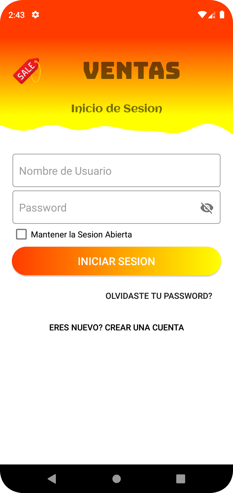
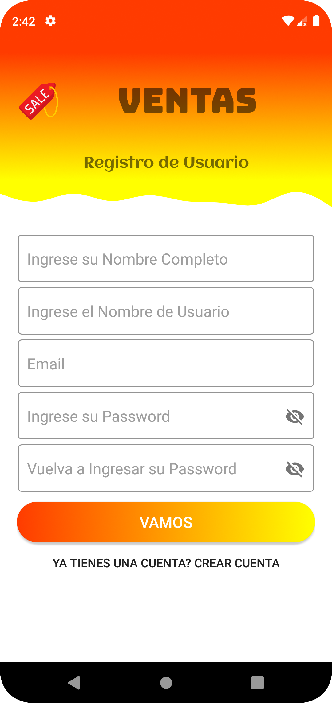
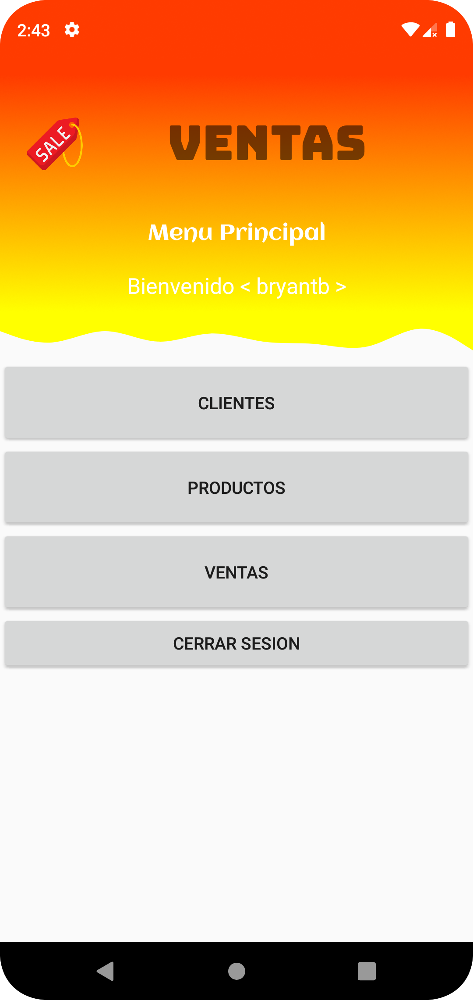
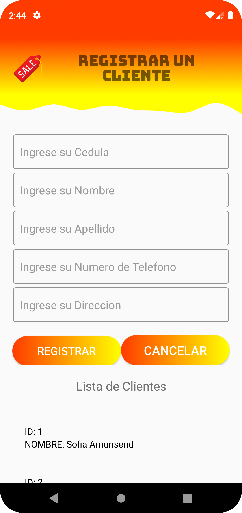
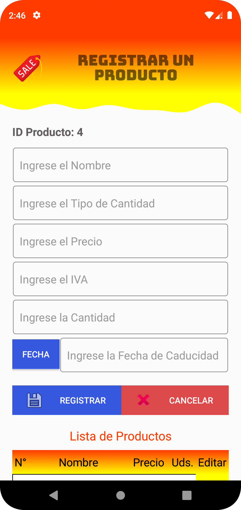
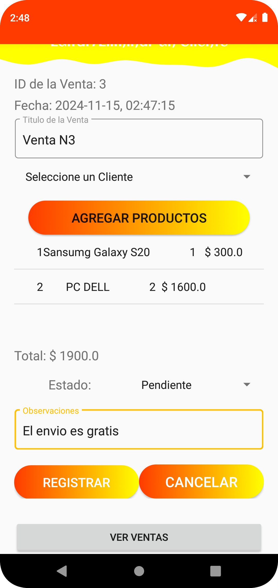

  <h1 align="center">Proyecto muy bueno de ventas</h1>

  
  
  

## Indice

## Descripción
Este proyecto es una Aplicación Móvil para gestionar la venta de diferentes productos. Creada en Android Studio, desarrollada con lenguaje Java.
Funciones Principales:
 - Inicio de sesión, mantiene activa la sesión
 - Creacion de una cuenta
 - CRUD productos
 - CRUD ventas
 	-- Cuadro de Dialogo que afecta a la pantalla principal.
### Tecnologías

## Dominio

## Funciones
<table>
  <tr>
    <td witdh="50%">
      <h3 align="center">Splash Screen</h3>
      

        
        

          - Primera pantalla de la aplicación, animación de cierre entre el icono de la aplicación y el nombre de la misma.
        

      

    </td>
    <td witdh="50%">
      <h3 align="center">Inicio de Sesión</h3>
      

        
        

          - Pantalla de Inicio de Sesión, solo pueden ingresar usuarios que esten registrados en la base de datos. 
          - Opción de mantener activa la sesión, incluso si se cierra la aplicación.
        

      

    </td>
  </tr>
  
  <tr>
    <td witdh="50%">
      <h3 align="center">Crear un Usuario</h3>
      

        
        

          - Crear una cuenta de usuario para acceder a la aplicación. Campo de confirmación de contraseña.
        

      

    </td>
    <td witdh="50%">
      <h3 align="center">Menú Principal</h3>
      

        
        

          - Saludo de bienvenida al usuario. Opciones: Gestión de Clientes, Gestión de Productos, Gestión de Ventas y Opción para Cerrar Sesión. 
        

      

    </td>
  </tr>

  
  <tr>
    <td witdh="50%">
      <h3 align="center">Gestión de Clientes</h3>
      

        
        

          - CREATE, LIST, UPDATE, DELETE clientes.
        

      

    </td>
    <td witdh="50%">
      <h3 align="center">Gestión de Productos</h3>
      

        
        

          - CREATE, LIST, UPDATE, DELETE productos.  
        - La fecha de caducidad no puede ser menor que la fecha actual. 
        

      

    </td>
  </tr>

  <tr>
    <td witdh="100%" colspan="2">
      <h3 align="center">Gestión Ventas</h3>
      

        
        

          - CREATE, LIST Ventas
          - Uso de Dialog para seleccionar el producto y la cantidad a vender. 
          - Seleccionar el cliente de la venta.
        

      

    </td>
    
  </tr>
</table>

Probar la aplicación: 

[Descargar la aplicación](https://github.com/bnphony/Ventas-AS/tree/master/img_ventas/app.apk)

## Autor
Codificado por [Bryan Jhoel Tarco Taipe](https://github.com/bnphony)

### Contacto

## Licencia de Uso
Este repositorio y todo su contenido está licenciado bajo licencia **Creative Commons**. Por favor si compartes, usas o modificas este proyecto cita a su
autor, y usa las mismas condiciones para su uso docente, formativo o educativo y no comercial.

